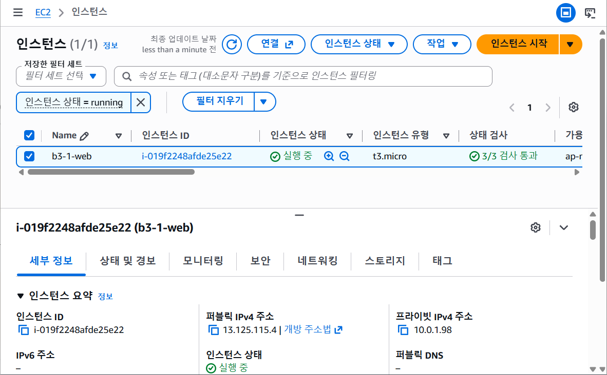

# B3-1 AWS EC2 웹 서버 배포

## 외부 접속 검증
- 검증 방식: **(A) 브라우저 접속**
  - Nginx 설치만으로 페이지가 나와서 별도 `/health` 설정이 필요 없다.
- 접속 정보: `http://13.125.115.4` (실습 종료 후 리소스를 삭제해서 현재는 접속되지 않는다)
- 접속 결과: Nginx 기본 페이지 "Welcome to nginx!" 표시

