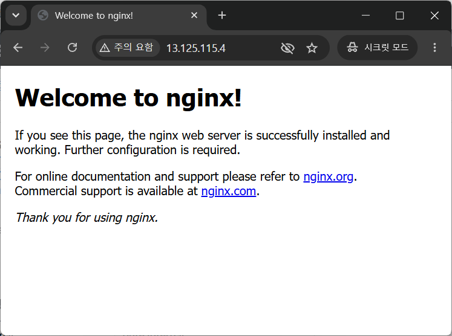
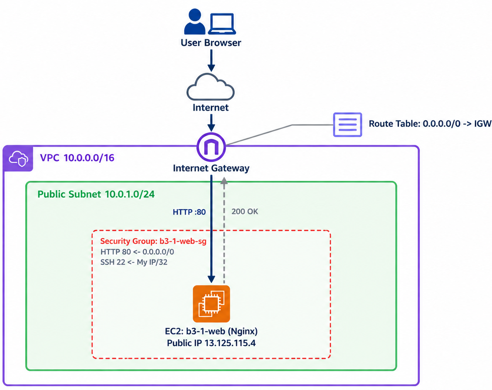

# B3-1 AWS EC2에 웹 서버 배포하기

AWS 서울 리전(`ap-northeast-2`)에 VPC·Subnet·IGW·보안 그룹·EC2(Nginx)를 직접 구성해 웹 페이지를 인터넷에 공개하고, 접속 장애를 재현·해결한 뒤 리소스를 모두 정리한 기록입니다. 코드 대신 **설정 증빙**이 결과물입니다.

## 외부 접속 검증

| 항목 | 내용 |
| --- | --- |
| 검증 방식 | **(A) 브라우저 접속** |
| 접속 정보 | `http://13.125.115.4` |
| 결과 | Nginx 기본 페이지 "Welcome to nginx!" 표시 |
| 현재 상태 | 실습 종료 후 리소스를 삭제해 **접속되지 않음** |

Nginx 설치만으로 페이지가 나오므로 별도 `/health` 엔드포인트 없이 방식 A를 택했습니다.

## 아키텍처

인터넷 → Internet Gateway → Route Table(`0.0.0.0/0 → IGW`) → Public Subnet → 보안 그룹 → EC2(Nginx) 순으로 트래픽이 흐릅니다.

## 구성 요약

| 리소스 | 값 | 선택 이유 |
| --- | --- | --- |
| 접근 계정 | IAM 사용자 (`AmazonEC2FullAccess`만 연결) | 루트 계정 미사용. `AdministratorAccess`보다 훨씬 좁은 관리형 정책으로 실수 없이 설정 |
| VPC / Subnet | `10.0.0.0/16` / Public `10.0.1.0/24` (퍼블릭 IP 자동 할당) | 인스턴스가 공인 IP를 받아 외부에서 접근 가능 |
| 라우팅 | IGW를 VPC에 연결, Route Table에 `0.0.0.0/0 → IGW` | 이 경로가 있어야 Subnet이 인터넷과 통신 |
| 보안 그룹 `b3-1-web-sg` | 인바운드 HTTP 80 `0.0.0.0/0`, SSH 22 내 IP(`/32`)만 | 필요한 포트만 허용, 전체 포트 개방 규칙 없음. 내 IP는 콘솔 "My IP" 자동 입력 사용 |
| EC2 `b3-1-web` | Ubuntu 24.04 · `t3.micro` · EBS 8GiB | Ubuntu는 자료가 많고 `apt` 설치가 간단, `t3.micro`는 서울 리전 프리티어 포함 |
| 웹 서버 | Nginx (`apt install`) | 설치만으로 응답 페이지 제공 |

## 검증 방법

| 확인 항목 | 방법 | 결과 |
| --- | --- | --- |
| IAM 로그인 | 루트 로그아웃 후 IAM 사용자로 재로그인 | 통과 |
| 라우팅 | Route Table에서 `0.0.0.0/0 → IGW` 확인 | 통과 |
| SG 규칙 | 인바운드에 80·22 두 규칙만 있는지 확인 | 통과 |
| 서버 내부 | `systemctl status nginx`, `curl -I http://localhost` | active, 200 |
| 외부 접속 | 내 PC 브라우저로 `http://13.125.115.4` | 페이지 표시 |
| 정리 | 콘솔에서 EC2·EBS·EIP·IGW·VPC 목록 확인 | 모두 삭제 |

## 증빙 캡처

| 단계 | 파일 (`docs/captures/`) | 보여 주는 것 |
| --- | --- | --- |
| 2. 네트워크 | `step2_vpc.png` `step2_subnet.png` `step2_igw.png` `step2_routetable.png` | VPC, Subnet, IGW, 라우팅 경로 |
| 3. 보안 그룹 | `step3_sg_overview.png` `step3_sg_inbound.png` | SG 개요, 인바운드 규칙 |
| 4. EC2 | `step4_ec2_launch_config.png` `step4_ec2_running.png` `step4_ec2_network.png` `step4_ssh_login.png` `step4_nginx_status.png` `step4_curl_localhost.png` | 인스턴스 설정·실행, SSH 접속, Nginx 상태, 내부 curl |
| 5. 외부 접속 | `step5_browser_access.png` `step5_ec2_publicip.png` | 브라우저 접속 결과, 퍼블릭 IP |
| 6. 트러블슈팅 | `step_6_01_sg_http_removed.png` ~ `step_6_04_recovered.png` | 규칙 삭제, 타임아웃, 서버 정상 확인, 복구 |
| 8. 정리 | `step_8_01_ec2_terminated.png` ~ `step_8_05_vpc_deleted.png` | EC2·EBS·EIP·IGW·VPC 삭제 후 목록 |

## 문서

- [트러블슈팅 보고서](docs/troubleshooting.md): SG의 80 규칙을 일부러 삭제해 외부 타임아웃을 재현하고 "서버 내부 curl → SG → 라우팅" 순으로 원인을 좁힌 기록
- [리소스 정리 체크리스트](docs/cleanup-checklist.md): 삭제 항목별 근거와 삭제 순서·이유
